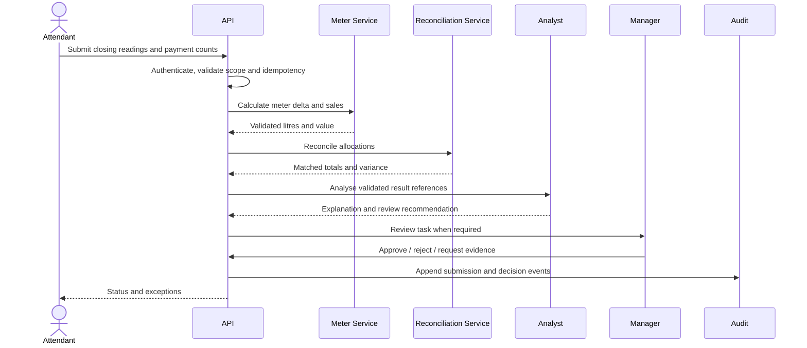

# Shift Close and Reconciliation

```mermaid
sequenceDiagram
 actor Attendant
 participant API
 participant Meter as Meter Service
 participant Finance as Reconciliation Service
 participant Agent as Analyst
 participant Manager
 participant Audit
 Attendant->>API: Submit closing readings and payment counts
 API->>API: Authenticate, validate scope and idempotency
 API->>Meter: Calculate meter delta and sales
 Meter-->>API: Validated litres and value
 API->>Finance: Reconcile allocations
 Finance-->>API: Matched totals and variance
 API->>Agent: Analyse validated result references
 Agent-->>API: Explanation and review recommendation
 API->>Manager: Review task when required
 Manager->>API: Approve / reject / request evidence
 API->>Audit: Append submission and decision events
 API-->>Attendant: Status and exceptions
```
Machine-level meter accounting remains distinct from shift/operator accountability. Shared-machine staffing must be represented explicitly.
